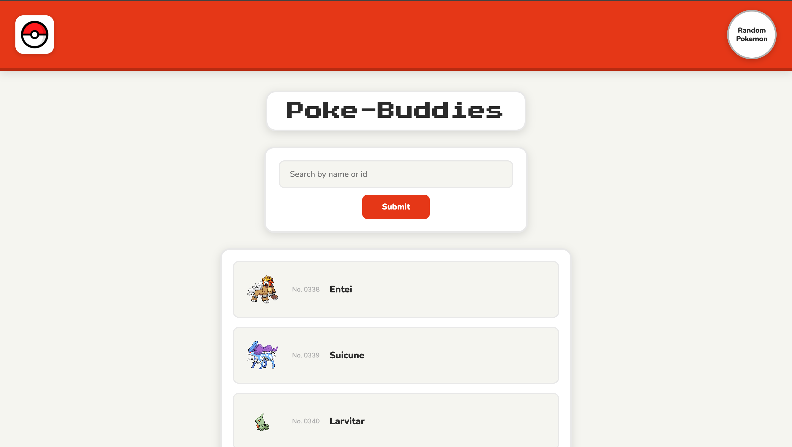
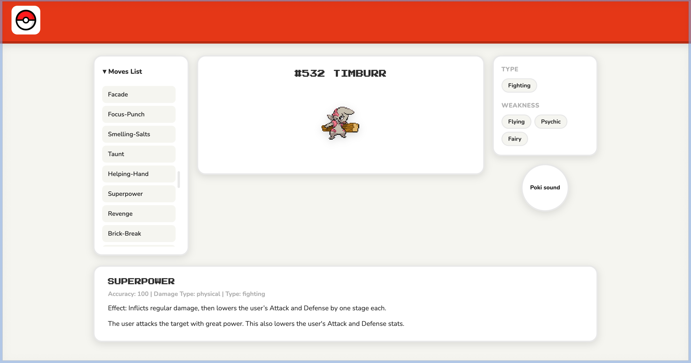

# Poke-Buddies

Poke-Buddies is a Pokémon encyclopedia web app that lets users search for any Pokémon by name or ID, browse a randomly generated selection on the home page, and dive into detailed information including moves, types, and weaknesses on a dedicated info page. The app fetches live data from the PokéAPI and presents it in a clean, responsive interface styled to feel at home in the Pokémon universe.

**Live Site:** [https://chris-joshua-mls.github.io/mod-4-project/](https://chris-joshua-mls.github.io/mod-4-project/)

---

## Team

- Christopher Hackett
- Joshua Caleb Akinyemi

---

## API

**PokéAPI** — [https://pokeapi.co](https://pokeapi.co)

| Endpoint | Usage |
|---|---|
| `GET /api/v2/pokemon/{id or name}` | Fetch Pokémon data (sprites, moves, types, stats) |
| `GET /api/v2/type/{name}` | Fetch type weakness data |
| `GET /api/v2/move/{name}` | Fetch move details (accuracy, damage class, effect) |

---

## Features

### MVP Features
- **Search by name or ID** — Users can enter any Pokémon's name or Pokédex number into the search bar on the home page to navigate directly to that Pokémon's info page.
- **Random Pokémon list** — The home page loads a randomized selection of 10 Pokémon on each visit, each displaying their sprite, Pokédex number, and name.

### Stretch Features
- **Move details on click** — Clicking a move from the moves list reveals detailed information including accuracy, damage class, type, and in-game effect description.
- **Pokémon cry / sound** — A sound button on the info page plays the selected Pokémon's cry audio.

---

## Setup Instructions

```bash
npm install
npm run dev
```

The app will be available at `http://localhost:5173` by default.

---

## Tech Stack

- HTML
- CSS
- JavaScript (ES Modules)
- Vite
- PokéAPI (REST)

---

## AI Usage

[View AI Usage Document](https://docs.google.com/document/d/16x53FxCu9GBfpy8uOqa0sjLnO3hYGuVPKNj28Au4jDk/edit?usp=sharing)

---

## Screenshots

**Home Page**


**Info Page**


---

## Future Improvements

- **Evolution chains** — A future improvement would display a Pokémon's full evolution line on the info page, allowing users to navigate between evolutions easily.
- **Type chart** — A full interactive type effectiveness chart would give users a quick reference for all type matchups without having to look up individual Pokémon.